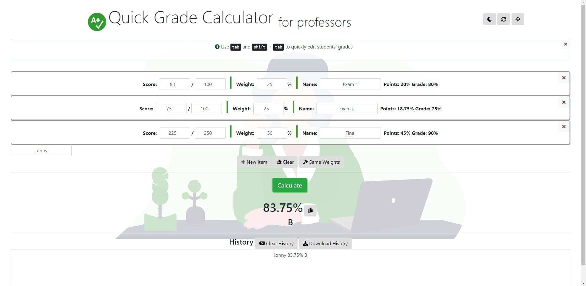

# Grade Calculator &mdash; RGB Studios

**A simple, quick grade calculator for professors**

*Use Grade Calc to calculate students' grades quickly and simply*

http://rgbstudios.org/grade-calc

Note: This webpage doesn't store cookies, so when you refresh or close it, your information will be gone. For the chrome app version, go [here](https://chrome.google.com/webstore/detail/amomifflklnjfjcamncbnepiakdfnjca/publish-delayed?hl=en&gl=US) or view its repo [here](https://github.com/rgbstudios/grade-calc-chrome-app).

### Options

##### Setup

✅ Add as many assignments as you'd like, click "New Item" to add a new one,or the close button on the top of each assignment to remove it

✅ Name your assignments to easily keep track of them

✅ Assign weights to your assignments. If weights no not add up to 100, they will be weighted relative to each other, so if the total weights are 1000, then an assignment worth 200 will be worth 20%

✅ Enter total scores those assignments are out of

✅ Optional: Use the gavel button titled "Same Weights" to make all assignments equally weighted.

##### Grading

✅ Click on the score of the first assignment and start with the first student's grade.

✅ Enter their scores for each assignment and their name, then click "Calculate" to receive their final (or current) grade

✅ Optional: Use <kbd>tab</kbd> and <kbd>shift</kbd> + <kbd>tab</kbd> to easily navigate the student grade inputs, so you can quickly enter students' grades.

✅ Optional: You can click the "Clear" button to clear the inputs for the next student.

##### Other Features:

✅ The top right corner features a night mode button, to darken the screen for late night grading, a refresh button to reload the page, and a fullscreen button, to give you more space to work with

✅ The bottom of the page features a history log, so you can view all of the students' grades at once when you're done.

### About

About cookies: We're not using cookies in order to keep the UI clean and for a consistent user experience. We also don't want graders accidently losing all of their progress upon clearing cookies. You can download your grade information as a .txt file, with more features on the way.

Images from https://undraw.co

Contact: [contact@rgbstudios.org](mailto:contact@rgbstudios.org)

Version 1.1.0

by [Justin Golden](https://justingolden21.github.io) for [RGB Studios](https://rgbstudios.org)
